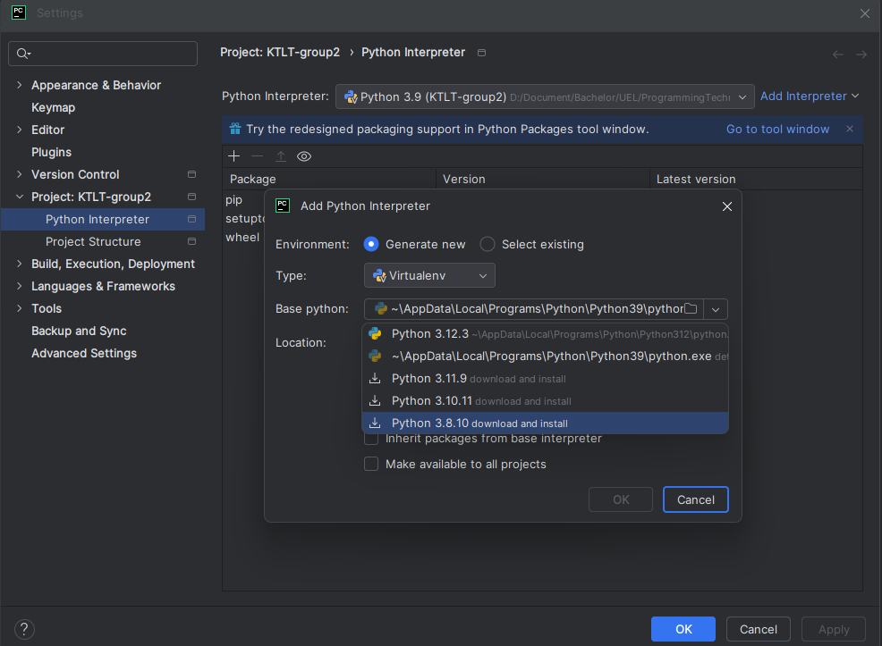
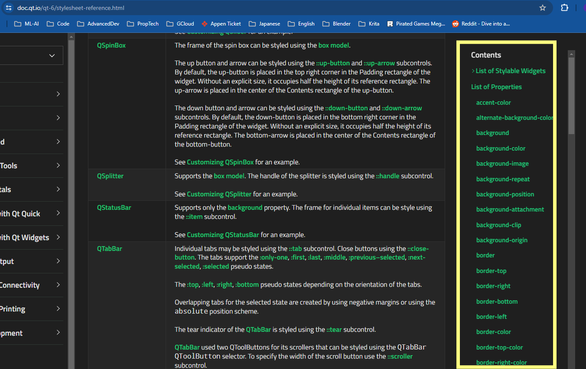

# Welcome 

**Description:**

- **README.md:** Description of the project.
- **requirements.txt:** List of Python dependencies required for the project.
- **main.py:** Entry point of the application.
- **ui/:** Directory containing UI-related files.
    - **main_window.ui:** Main window layout file.
    - Other UI-related files.
- **src/:** Source code directory.
    - **_\_init__.py:** Package initialization file.
    - **utils.py:** Utility functions.
    - **helper_functions.py:** Additional helper functions.
    - **ui_main_window.py:** Automatically generated Python code from main_window.ui.
- **qss/:** Directory for Qt Style Sheets (QSS) and icons.
    - **scss/:** SCSS files for styling.
    - **icons/:** Icon images.
- **logs/:** Directory for log files.
    - **custom_widgets.log:** Log file.
- **json_styles/:** Directory for JSON style files.
-   **style.json:** Example JSON style file.
- **generated-files/:** Directory for files auto-generated by the custom widgets module.
    - Example generated files include **UI's** and **JSon** files

This structure allows for automatic conversion of UI files to Python code and placement within the src folder, simplifying the development process for users.

For more, visit https://github.com/KhamisiKibet/QT-PyQt-PySide-Custom-Widgets

# Developer Guide


## Windows

### Hướng dẫn cài đặt:

1. **Tải xuống và cài đặt** [GTK+2 for Windows Runtime Environment - fix for cairo-2](https://github.com/tschoonj/GTK-for-Windows-Runtime-Environment-Installer/releases).
2. **Tạo môi trường ảo (.venv) với Python 3.9** (trong hình hiển thị 3.8 vì Python 3.9 đã được cài đặt sẵn).
   
   

3. **Cập nhật pip** bằng lệnh sau:
   ```cmd
   python.exe -m pip install --upgrade pip
   ```
4. **Tải xuống và cài đặt PySide, PyQt6**:
   ```cmd
   pip install PyQt6
   pip install PySide6
   ```
5. **Tải xuống và cài đặt pyQt6-tools**:
   ```cmd
   pip install PyQt6-tools
   ```
6. **Tải xuống và cài đặt Custom Widgets**:
   ```cmd
   pip install QT-PyQt-PySide-Custom-Widgets
   ```
7. **Tải dự án từ GitHub** và truy cập vào thư mục của dự án.
8. **Mở dòng lệnh (command line/terminal) bên trong thư mục `project/` và chạy**:
   ```cmd
   Custom_Widgets --monitor-ui ui --qt-library PyQt6
   ```
   **Giữ cửa sổ dòng lệnh này mở** trong khi chỉnh sửa giao diện UI bên trong Qt Designer để nó tự động cập nhật tệp `ui_interface.py`.
9. **Mở Qt Designer**, sau đó mở tệp `ui_interface` trong Qt Designer. **Tránh sử dụng "External tool" trong PyCharm** để mở tệp `.ui` vì nó có thể tiêu tốn quá nhiều RAM và làm PyCharm crash.
10. **Mở dự án trong PyCharm và chạy `main.py`** để kiểm tra xem mọi thứ có hoạt động không.
11. **Bắt đầu thiết kế/lập trình giao diện trong Qt Designer.** Nhớ thường xuyên lưu lại

### Sử dụng các Widget hiện đại trong thư viện Custom Widget
> Hiện project đã được setup để hoàn toàn tương thích với thư viện [Custom Widget](https://khamisikibet.github.io/Docs-QT-PyQt-PySide-Custom-Widgets/docs/widgets), nên hãy tự do khám phá các widget trong đây và lựa chọn cái phù hợp để áp dụng vào thiết kế.
>
> Hãy xem kỹ hướng dẫn cho mỗi thành phần vì chúng đều khác nhau. 
> 
!!! Chú ý file interface.ui chưa được setup với bất kỳ thành phần nào trong thư viện mà hoàn toàn thuần thúy tạo bởi các thành phần có sẵn của PyQt6.


### Chỉnh SCSS cho các thành phần
1. Copy tên của thành phần trong Qt Designer 
2. Mở ```Qss/scss/defaultStyle.css```
3. Dán ```#<tên thành phần>{}``` vào như mẫu có sẵn trong file này
4. Thêm các thuộc tính mới dựa trên [Style Sheet reference](https://doc.qt.io/qt-6/stylesheet-reference.html), chú ý danh sách thuộc tính bên tay phải

5. Riêng giá trị cho màu sắc bao gồm tên tiếng Anh và chuỗi rgb vd: white, #fff, #ffffff, rgb(255,255,255) đều là màu trắng
6. Cần thử nghiệm xem các đơn vị nào của CSS áp dụng được trong QSS/scss. Hiện tại ```px``` là đơn vị chắc chắn áp dụng được

### Installation Guide:

1. Download and install [GTK+2 for Windows Runtime Environement - fix for cairo-2](https://github.com/tschoonj/GTK-for-Windows-Runtime-Environment-Installer/releases)
2. Create a .venv with Python 3.9 (in the picture it shows 3.8 because I have already installed Python 3.9)

3. update pip
```
python.exe -m pip install --upgrade pip
```
4. Download and install PySide, PyQt6
```cmd
pip install PyQt6
pip install PySide6
```
5. Download and install pyQt6-tools
```bash
pip install PyQt6-tools
```
6. Download and install Custom Widgets:
```cmd
pip install QT-PyQt-PySide-Custom-Widgets
```
7. pull the project from github and go to the directory of the project
8. Inside the ```project/``` folder, open command line/ terminal and run
```cmd
Custom_Widgets --monitor-ui ui --qt-library PyQt6
```
Keep this command line open while you change the UI inside Qt Designer so it may autoamtically update the generated ```ui_interface.py``` file for you
9. Open Qt Designer and open file ui_interface inside Qt Designer. Try NOT to use "External tool" inside PyCharm to open ui file with Qt Designer as it may use too much Ram and cause PyCharm to crash.
10. Open the project in PyCharm and run ```main.py``` to check if everything works
11. Start Designing/Coding your Screen inside the QtDesigner. Remember to save often.
